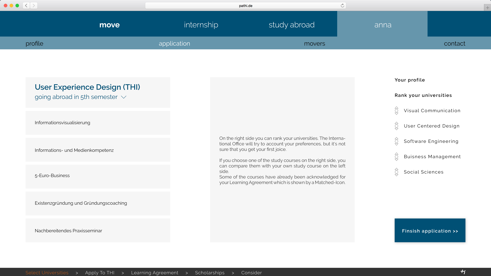

# Konzept

Hier finden Sie eine Erkärung unseres vollständigen Konzeptes. Es sind Beschreibungen der einzelnen Funktionen und ihre Umsetzung dokumentiert. Der Hauptfokus lag dabei darauf, den Nutzern das aussuchen einer für sie passenden Univerität zu erleichtern und bei Themen wie dem Learning Agreement oder Stipendien so gut wie möglich Hilfestellung zu leisten. Eine automatisierte Lösung auf der Website für diese beiden Probleme ist aus unserer sicht mit den Mitteln und der Organisation der THI nicht zu realisieren.

##Home

###Argumentation
Die Startseite soll bei Studenten, die die Website zum erstem Mal besuchen einladend wirken und das Interesse wecken, sich weiter mit der Seite und damit auch dem Thema Auslandssemester zu beschäftigen. Durch das direkte Ansprechen des Nutzers (nach dem Login) soll er auf direkt auf einer persönlichen Ebene abgeholt werden. Es soll ein "Es geht hier um dich" - Gefühl vermittelt werden, das bei der aktuellen, mühsamen Informationssuche über Moodle komplett verloren geht. Aus diesem Grund haben wir auch die Farbe blau für für ihre beruhigende und Vertauenserzeugende Wirkung als Hintergrund und darauf das Orange, das als warme Farbe Optimismus und Glück erzeugt, gewählt. Diese beiden Leitfarben sind auf der Startseite besonders stark vertreten um beim Nutzer eine positive Grundstimmung zu erzeugen, sie ziehen sich allerdings auch durch die komplette Seite.

###Implementierung
Bei der Startseite an sich handelt es sich um eine Standard HTML Seite ohne die Verwendung von Angular Funktionen. Es wurde lediglich etwas Typescript zum erzeugen des Paralax Scroll Effektes verwendet.
  Login

##Study Abroad

###Worldmap

<h4>Argumentation</h4>
Auf der Weltkarte werden dem Nutzer zunächst alle verfügbaren Partneruniversitäten angezeigt. Über die Filtermöglichkeiten auf der rechten Seite kann er sich die Unis nach seinen Präferenzen filtern lassen oder, falls er schon weiß wohin er will, direkt nach einer bestimmten Universität suchen zu der er nähere Informationen erhalten möchte. Es ist wichtig, dass auf dieser Seite noch keine "Zu meinen Favoriten Hinzufügen" Option angeboten wird. Ins Ausland zu gehen ist eine ist zum einen in der Regel sehr teuer und kann zum anderen sehr schnell in eine sehr negative Erfahrung umschlagen, wenn man an einem Land oder einer Universität landet, in der man sich nicht wohl fühlen kann. Deshalb möchten wir sicher gehen, dass sich die Studenten nicht einfach schnell für eine Uni bewerben, von der sie irgendwann einmal von einem Freund eines Freundes etwaas positives gehört haben und dann enttäuscht werden wenn sie dort sind. 
Die Studenten sollen, auch wenn sie schon wissen oder zumindest meinen zu wissen wohin sie möchten, immer zuerst Informationen zu ihrem Reiseziel erhalten.

<h4>Implementierung</h4>
Für die Weltkarte haben wir letztendlich die standart <a href="https://www.mapbox.com/" target="_blank">Mapbox</a> Bibliothek verwendet. Wir hatten zuerst versucht, mit <a href="https://github.com/Wykks/ngx-mapbox-gl" target="_blank">Ngx Mapbox</a> zu arbeiten allerdings schien diese nicht wirklich mit unserer Angular Version kompatibel zu sein. Die Daten für die Punkte auf der Weltkarte haben wir mithilfe von HIER LÖSUNG EINFÜGEN implementiert.
Das Filtersystem steht im Moment noch auf der To Do Liste. Unser Lösungsansatz wäre gewesen, alle Universitäten in der Datenbank mit entsprechenden Tags zu versehen und den University Service entsprechend immer nur die Universitäten mit den richtigen Tags liefern zu lassen.

###General

<h4>Argumentation</h4>
Nachdem der Nutzer eine Universität zu näheren Betrachtung ausgwehält hat, gelangt er auf die entsprechende Detailseite. Hier findet er einen kurzen allgemeinen Einleitungstext zu der Universität sowie erste Eindrücke in Form von Bildern. Hier soll ganz bewusst ein erster Eindruck vermittelt werden. Der Nutzer soll bereits nach wenigen Sekunden feststellen können, ob diese Universität vielleicht einige seiner Grundbedingungen überhaupt nicht erfüllt. Mithilfe der sorgfältig ausgewählten Bilder erhält der Nutzer auch einen groben Überblick über das Umfeld der Universität. Gefällt ihm beispielsweise das Stadtbild nicht, kann er dies hier sofort feststellen und seine Suche fortsetzen, sodass er nicht zuerst eine halbe Stunde mit recherchieren verschwendet bevor ihm auffällt, dass er gar nicht in diese Stadt will.

<h4 id="implementationGeneral">Implementierung</h4>
Mithilfe des Angular Routings haben wir bei der Auswahl der Universität eine mit dieser gemappten ID der Route mitgegeben.
Diese ID lasen wir nun wieder aus der Route aus um mit dieser aus der Datenbank die richtigen Daten finden zu können. Mithilfe dieser Daten wird die komplette Seite mit dem Angular ID System dynamisch aufgebaut.

###Consider

<h4>Argumentation</h4>
Die Consider Seite liefert nochmal genauere Informationen, nicht nur zur Universität an sich sondern auch zur Stadt und der Region in der diese sich befindet. Unter der Spalte University befinden sich Informationen wie Semesterkosten, Fristen oder zum Beispiel sprachliche Voraussetzungen. Unter City sind die durchschnittlichen Wohn und Lebenshaltungskosten oder empfehlungen für die Fortbewegung innerhalb der Stadt zu finden. Unter Region findet man Informationen über, falls benötigt, das Visum, die Umweltbedingungen oder die Flugkosten.  
Der Nutzer hat hier also auf einen Blick alle Fakten und Informationen, über die er sich Gedanken machen muss, falls er sein Auslandssemester an dieser Universität absolvieren will und die ihn auch eventuell davon abhalten könnten.

<h4>Argumentation</h4>
Die implementierung erfolgte hier analog zu <a href="#implementationGeneral">General</a>.

###Experiences

<h4>Argumentation</h4>
Die Experiences Seite stellt alle Erfahrungsberichte übersichtlich dar. Auf der rechten Seite befinden sich wieder die Filteroptionen nach einem ähnlichen Schema, wie bereits auf der Weltkarte. Der Nutzer muss sich nicht mehr mühsam PDF Dateien aus einer Liste raussuchen, sondern bekommt die Erfahrungsberichte für ihn gefiltert in einem übersichtlichen Layout präsentiert.  

<h4 id="implementationGeneral">Implementierung</h4>
Die Komponente "experiences" ist jeweils in einzelne Komponenten "experiences-boxes" untergliedert. Diese beschreiben die einzelnen blauen Boxen und erhalten ihre Daten aus der Pseudodatenbank der zugehörigen Universität. Mit Klick auf einen Erfahrungsbericht wird man auf die detaillierte Seite der Erfahrungsberichte weitergeleitet. Diese ist jedoch aktuell noch, aufgrund der Beschränkung durch die Pseudo Datenbank, nicht an den jeweiligen Erfahrungsbericht angepasst. 

Nachdem der Nutzer sich für einen Erfahrungsbericht entschieden hat und diesen anklickt, kommt er auf die entsprechende Detailseite. Hier findet er eine Bewertung unterschiedlicher Kategorien mit 0 - 5 Sternen, sowie einen Text und oder Bilder vom Verfasser des Berichtes.

<h4>Argumentation</h4>
Die implementierung erfolgte hier analog zu <a href="#implementationGeneral">General</a>.

###Study Courses

<h4>Argumentation</h4>
Auf der Courses Seite kann der Nutzer sich über die an der Universität angebotenen Kurse informieren. Wie gewohnt befinden sich rechts wieder Filteroptionen und eine Suchfunktion. Hier kann der Student bereits vor der Bewerbung sichergehen, dass sich die angebotenen Kurse mit denen der THI überschneiden und somit später im Learning Agreement angerechnet werden können.  

Die Detailseite setzt sich aus genaueren Informationen über die in dem Kurs behandelten Themen, einer Bewertung falls dieser Kurs bereits von einem Studenten der THI besucht wurde und Erfahrungsberichten von Studenten die genau diesen oder einen ähnlichen Kurs besucht haben zusammen.

<h4>Argumentation</h4>
Die implementierung erfolgte hier analog zu <a href="#implementationGeneral">General</a>.

##User

###Profile

<h4>Argumentation</h4>
Auf der Profilseite sieht der Nutzer alle Informationen, die das International Office benötigt um seine Bewerbung zu bearbeiten. Mithilfe des Edit Buttons können alle Felder in jederzeit und in Echtzeit bearbeitet werden.

<h4>Implementierung</h4>
TODO

###Application

<h4>Argumentation</h4>
Unter Application befinden sich die Universitäten, die unter Study Abroad ausgewählt wurden.
Diese sind zunächst in zwei Listen unterteilt, die Favoritenliste und die Bewerbungsliste. Favorisiert der Nutzer unter Study Abroad eine Universität, so erscheint sie in der beliebig langen Favoritenliste. Mithilfe von Drag and Drop kann er sie von dort aus in seine Bewerbungsliste ziehen, die durch die Vorgaben der THI eine Länge von mindestens 1 bis maximal 5 haben muss. Logischerweise kann jede Universität auch jederzeit wieder aus beiden Listen entfernt werden.
Zusätzlich hat kann der Nutzer auf der rechten Seite noch seinen Bewerbungsfortschritt sehen. Sind beispielsweise unter Profile nicht alle Punkte ausgefüllt wird dies hier nochmal angezeigt. Ganz unten beim Bewerbungsfortschritt kann die Bewerbung, wenn letztendlich alles richtig ausgefüllt wurde, abgeschickt werden.

<h4>Implementierung</h4>
TODO

##Internship

###Argumentation
Internship war in der Umsetzung sehr problematisch, da von der Seite der THI hier überhaupt keine Hilfe angeboten wird. Es gibt nicht wie bei Study Abroad Partneruniversitäten oder etwas in der Art, die Studenten müssen sich um alles selbst kümmern. Deswegen zeigen wir unter Internship einfach nur, wie auch bei Study Abroad eine Weltkarte, in der die Firmen, in denen bereits Studenten waren, angezeigt werden. Falls vorhanden können dann auch Erfahrungsberichte zu den Firmen angezeigt werden.

###Implementierung
tbd!
 