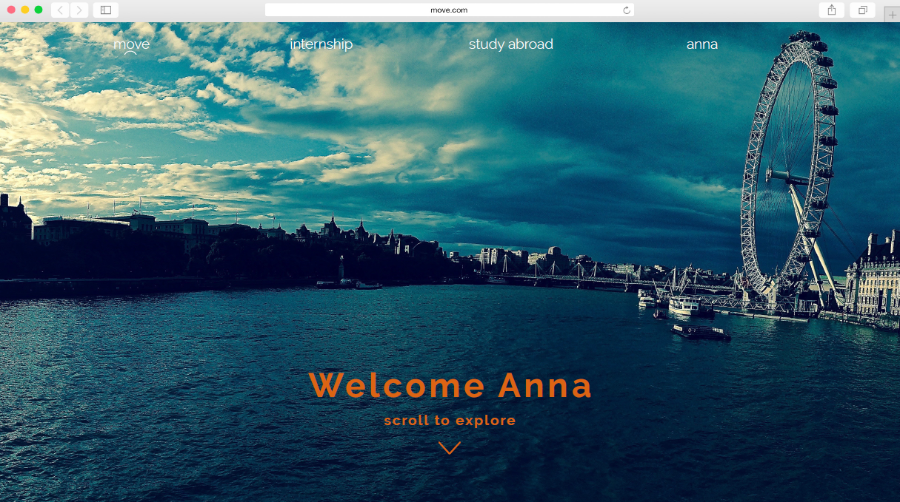
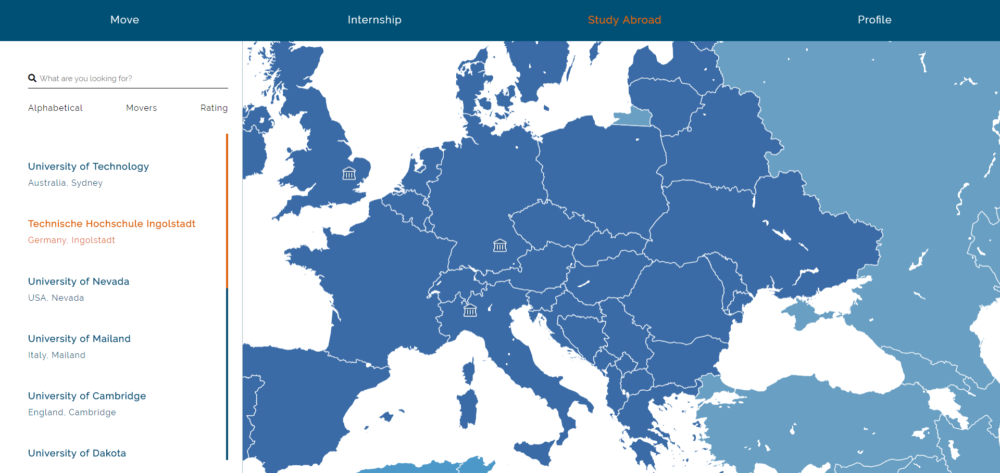

#Konzept
Hier finden Sie eine Erklärung unseres vollständigen Konzepts. Es sind Beschreibungen der einzelnen Funktionen und ihre Umsetzung dokumentiert. Der Hauptfokus lag dabei darauf, den Nutzern das Aussuchen einer für sie passenden Universität zu erleichtern und bei Themen wie dem Learning Agreement oder Stipendien so gut wie möglich Hilfestellung zu leisten. Eine automatisierte Lösung auf der Website für diese beiden Probleme ist aus unserer Sicht mit den Mitteln und der Organisation der THI nicht zu realisieren.

##Home

####Argumentation
Die Startseite soll bei Studenten, die die Website zum erstem Mal besuchen, einladend wirken und das Interesse wecken, sich weiter mit der Seite und damit dem Thema Auslandssemester zu beschäftigen. Durch das direkte Ansprechen des Nutzers (nach dem Login) soll er auf direkt auf einer persönlichen Ebene abgeholt werden. Es soll ein "es geht hier um dich"-Gefühl vermittelt werden, dass bei der aktuellen, mühsamen Informationssuche über Moodle komplett verloren geht. Aus diesem Grund haben wir die Farbe Blau für ihre beruhigende und vertrauenserzeugende Wirkung als Hintergrund und darauf das Orange, das als warme Farbe Optimismus und Glück erzeugt, gewählt. Diese beiden Leitfarben sind auf der Startseite besonders stark vertreten, um beim Nutzer eine positive Grundstimmung zu erzeugen, sie ziehen sich allerdings auch durch die komplette Seite.

####Implementierung
Bei der Startseite an sich handelt es sich um eine Standard HTML Seite ohne die Verwendung von Angular Funktionen. Es wurde lediglich etwas Typeskript zum Erzeugen des Paralax Scroll Effektes verwendet.

##Study Abroad
###Worldmap 

####Argumentation
Auf der Weltkarte werden dem Nutzer zunächst alle verfügbaren Partneruniversitäten angezeigt. Über die Filtermöglichkeiten auf der rechten Seite kann er sich die Unis nach seinen Präferenzen filtern lassen oder, falls er schon weiß wohin er will, direkt nach einer bestimmten Universität suchen, zu der er nähere Informationen erhalten möchte. Es ist wichtig, dass auf dieser Seite noch keine "Zu meinen Favoriten hinzufügen"-Option angeboten wird. Ins Ausland zu gehen ist zum einen in der Regel teuer und kann zum anderen schnell in eine negative Erfahrung umschlagen, wenn man an einem Land oder einer Universität landet, in der man sich nicht wohlfühlt. Deshalb möchten wir sichergehen, dass sich die Studenten nicht schnell für eine Uni bewerben, von der sie irgendwann einmal von einem Freund eines Freundes etwas Positives gehört haben und dann enttäuscht werden, wenn sie dort sind. 
Die Studenten sollen, auch wenn sie schon wissen oder zumindest meinen zu wissen, wohin sie möchten, immer zuerst Informationen zu ihrem Reiseziel erhalten.

####Implementierung
Für die Weltkarte haben wir letztendlich die Standard <a href="https://www.mapbox.com/" target="_blank">Mapbox</a> Bibliothek verwendet. Wir hatten zuerst versucht, mit <a href="https://github.com/Wykks/ngx-mapbox-gl" target="_blank">Ngx Mapbox</a> zu arbeiten, allerdings schien diese nicht mit unserer Angular Version kompatibel zu sein. Die Daten für die Punkte auf der Weltkarte haben wir mithilfe von <mark>hier Lösung einfügen</mark> implementiert.
<mark>Das Filtersystem steht im Moment noch auf der To Do Liste.</mark> Unser Lösungsansatz wäre gewesen, alle Universitäten in der Datenbank mit entsprechenden Tags zu versehen und den University Service entsprechend nur die Universitäten mit den richtigen Tags liefern zu lassen.

* ###Zoom zur Universität

<mark>Beschreibung der Implementierung fehlt noch</mark>

* ###Detailansicht der Universitäten 

<mark>Beschreibung der Implementierung fehlt noch</mark>

###General 

####Argumentation
Nachdem der Nutzer eine Universität zu näheren Betrachtung ausgewählt hat, gelangt er auf die entsprechende Detailseite. Hier findet er einen kurzen allgemeinen Einleitungstext zu der Universität sowie erste Eindrücke in Form von Bildern. Hier soll ganz bewusst ein erster Eindruck vermittelt werden. Der Nutzer soll nach wenigen Sekunden feststellen können, ob diese Universität seine Grundbedingungen nicht erfüllt. Mithilfe der sorgfältig ausgewählten Bilder erhält der Nutzer zusätzlich einen groben Überblick über das Umfeld der Universität. Gefällt ihm beispielsweise das Stadtbild nicht, kann er dies sofort feststellen und seine Suche fortsetzen, ohne lange Zeit für Recherche zu verschwenden.

<h4 id="implementationGeneral">Implementierung</h4>
Mithilfe des Angular Routings haben wir bei der Auswahl der Universität eine mit dieser gemappten ID der Route mitgegeben.
Diese ID lasen wir wieder aus der Route aus, um mit dieser aus der Datenbank die richtigen Daten finden zu können. Mithilfe dieser Daten wird die komplette Seite mit dem Angular ID System dynamisch aufgebaut.

###Consider 

####Argumentation
Die Consider-Seite liefert nochmal genauere Informationen, nicht nur zur Universität, sondern auch zur Stadt und der Region in der diese sich befindet. Unter der Spalte University befinden sich Informationen wie Semesterkosten, Fristen oder sprachliche Voraussetzungen. Unter City sind die durchschnittlichen Wohn- und Lebenshaltungskosten oder Empfehlungen für die Fortbewegung innerhalb der Stadt zu finden. Unter Region findet man Informationen über Visa, die Umweltbedingungen oder die Flugkosten.

Der Nutzer hat hier auf einen Blick alle Fakten und Informationen, über die er sich Gedanken machen muss, falls er sein Auslandssemester an dieser Universität absolvieren will.

####Implementierung
Die Implementierung erfolgte hier analog zu <a href="#implementationGeneral">General</a>.

###Experiences

####Argumentation
Die Experiences-Seite stellt alle Erfahrungsberichte übersichtlich dar. Auf der rechten Seite befinden sich die Filteroptionen nach einem ähnlichen Schema wie auf der Weltkarte. Der Nutzer muss sich nicht mehr mühsam PDF-Dateien aus einer Liste raussuchen, sondern bekommt die Erfahrungsberichte für ihn gefiltert in einem übersichtlichen Layout präsentiert.

####Implementierung
Die Komponente "experiences" ist jeweils in einzelne Komponenten "experiences-boxes" untergliedert. Diese beschreiben die einzelnen blauen Boxen und erhalten ihre Daten aus der Pseudodatenbank der zugehörigen Universität. Mit Klick auf einen Erfahrungsbericht wird man auf die detaillierte Seite der Erfahrungsberichte weitergeleitet. Diese ist aktuell noch, aufgrund der Beschränkung durch die Pseudodatenbank, nicht an den jeweiligen Erfahrungsbericht angepasst. 

<b>Filterung</b>

Die Filter sind auf allen Seiten gleich gestylt und werden aus der SCSS-Datei der „app-filter“ Komponente geladen. Zusätzlich beinhaltet diese Komponente eine Komponente „app-searchbar“ für die einheitliche Suchleiste über den Filterkategorien. Sobald eine Seite die Filteroptionen nutzt wird die SCSS Datei der Filter-Komponente in die SCSS Datei der jeweiligen Seite importiert. 

Die jeweiligen Filteroptionen (filter-points) der einzelnen Filterkategorien (filter-category), wie Sorting oder Language, werden mit ngFor (*ngFor= “let sorting of sortings“) aus der Typescript Datei der zugehörigen Seite geladen. Diese beinhaltet für jede Filterkategorie einen Array mit allen Filteroptionen. Dieser wird an einigen Stellen auf der Anzeige nach einer Länge von 3 Elementen (slice:0:3) abgeschnitten und ein More-Button hinzugefügt. Durch diesen Button kann der Rest des Arrays angezeigt werden und somit die übrigen Filteroptionen gewählt werden. Sobald die Optionen durch „More“ ausgeklappt wurden, erscheint ein „Less“ Button, um die Optionen wieder einzuklappen. 

Die jeweils durch einen Klick aktivierte Filteroption erhält die Klasse „active“ und erscheint in orange, bis eine andere Filteroption geklickt wurde:  
[class.active]="ssclicked === sortingsmall" (click)="ssclicked = (ssclicked === sortingsmall ? null :sortingsmall)"

Aktuell können durch den Nutzer bestimmte Filteroptionen aktiviert werden, die eigentliche Filterung der Anzeige wurde aber nicht implementiert. Das liegt daran, dass nur eine Pseudodatenbank zur Verfügung steht. Daher wurde nur die Darstellung implementiert.

###Experiences im Detail

Nachdem der Nutzer sich für einen Erfahrungsbericht entschieden hat und diesen anklickt, kommt er auf die entsprechende Detailseite. Hier findet er eine Bewertung unterschiedlicher Kategorien mit 0 - 5 Sternen, sowie einen Text und oder Bilder vom Verfasser des Berichtes.

####Implementierung
Die Implementierung erfolgte hier analog zu <a href="#implementationGeneral">General</a>.

###Study Courses

####Argumentation
Auf der Courses-Seite kann der Nutzer sich über die an der Universität angebotenen Kurse informieren. Wie gewohnt befinden sich rechts Filteroptionen und eine Suchfunktion. Hier kann der Student bereits vor der Bewerbung sichergehen, dass sich die angebotenen Kurse mit denen der THI überschneiden und somit später im Learning Agreement angerechnet werden können.

Die Detailseite setzt sich aus genaueren Informationen über die in dem Kurs behandelten Themen, einer Bewertung falls dieser Kurs bereits von einem Studenten der THI besucht wurde und Erfahrungsberichten von Studenten die genau diesen oder einen ähnlichen Kurs besucht haben, zusammen.

####Implementierung
Die Implementierung erfolgte hier analog zu <a href="#implementationGeneral">General</a>.

##User
###Profile 

####Argumentation
Auf der Profilseite sieht der Nutzer alle Informationen, die das International Office benötigt, um seine Bewerbung zu bearbeiten. Mithilfe des Edit-Buttons können alle Felder jederzeit und in Echtzeit bearbeitet werden.

####Implementierung
Das Layout wurde mithilfe von drei Tabellen aufgebaut und die Daten des angemeldeten Nutzers werden aus der Pseudodatenbank herangezogen. 
Auf dieser Unterseite befinden sich die Daten des angemeldeten Users.
Einige Daten, wie z.B. E-Mail, Mobile und Emergency Contact kann der Benutzer durch Anklicken des "Edit-Buttons" bearbeiten und abspeichern.
Die abgespeicherten Daten werden an die Pseudodatenbank übermittelt und zur Laufzeit mit der Funktion save(), die die persönlichen Daten der Studenten mit den neuen eingetragenen Werten überschreibt, übergeben.

###Application 

####Argumentation
Unter Application befinden sich die Universitäten, die unter Study Abroad ausgewählt wurden.
Diese sind zunächst in zwei Listen unterteilt, die Favoritenliste und die Bewerbungsliste. Favorisiert der Nutzer unter Study Abroad eine Universität, so erscheint sie in der beliebig langen Favoritenliste. Mithilfe von Drag and Drop kann er sie von dort aus in seine Bewerbungsliste ziehen, die durch die Vorgaben der THI eine Länge von mindestens 1 bis maximal 5 haben muss. Logischerweise kann jede Universität auch jederzeit wieder aus beiden Listen entfernt werden.
Zusätzlich hat kann der Nutzer auf der rechten Seite noch seinen Bewerbungsfortschritt sehen. Sind beispielsweise unter Profile nicht alle Punkte ausgefüllt, wird dies hier nochmal angezeigt. Ganz unten beim Bewerbungsfortschritt kann die Bewerbung, wenn letztendlich alles richtig ausgefüllt wurde, abgeschickt werden.

####Implementierung
Auf dieser Seite wird der eigentliche Bewerbungsprozess in die Wege geleitet. Sie beinhaltet eine "Drag and Drop"-Funktionalität.
Im linken Bereich werden die vom Studenten als Favorit gesetzten Universitäten aufgelistet. Favoriten kann man hier durch klick des "x"-Buttons aus der Liste entfernen.
Diese Universitäten in der Favoritenliste sind "draggable", d.h. mit der Maus bewegbar.
Im rechten Bereich ist die Rangliste (Liste der Universitäten bei dem der Student sich bewirbt).
In diese Liste muss der Student nun die Favoriten einzeln in die „Dropzone“ hineinlegen.
Innerhalb der Rangliste können die Universitäten frei nach Belieben geordnet oder wieder gelöscht werden. Die Liste darf maximal 5 Favoriten enthalten, da man sich im Bewerbungsprozess bei bis zu 5 Universitäten bewerben kann. Sobald sich mindestens eine Universität in der Rangliste befindet, blendet sich der "Finish-Application"-Button ein.

* #### Add to Favorits - Button 

<mark>Eine Erklärung der Implementierung des add to favorits Button</mark>

###Contact

####Argumentation
Diese Seite beinhaltet lediglich die Kontaktdaten der THI und die des International Office für Auslands- und Studienangelegenheiten.

####Implementierung
tbd!

##Internship 
####Argumentation
Internship war in der Umsetzung sehr problematisch, da von der Seite der THI hier überhaupt keine Hilfe angeboten wird. Es gibt nicht wie bei Study Abroad Partneruniversitäten oder etwas in der Art, die Studenten müssen sich um alles selbst kümmern. Deswegen zeigen wir unter Internship einfach nur, wie auch bei Study Abroad eine Weltkarte, in der die Firmen, in denen bereits Studenten waren, angezeigt werden. Falls vorhanden können dann auch Erfahrungsberichte zu den Firmen angezeigt werden.

####Implementierung
tbd!