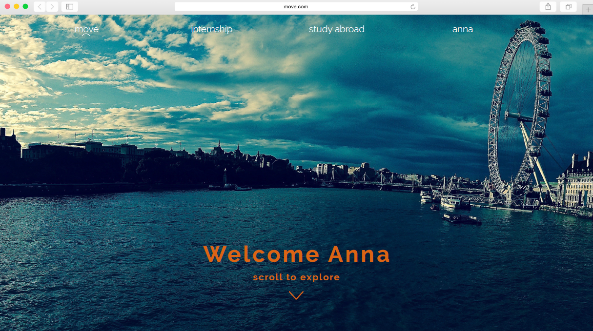

#Projekt Move - Dokumentation
Hier finden Sie die Dokumentation zu unserer Implementierung des MOVE Projekts, das im Rahmen des 3. Semesters (WS 17/ 18) des Studiengangs User Experience Design vom International Office der Technischen Hochschule Ingolstadt in Auftrag gegeben wurde.
Move ist eine Website, die es den Studenten der THI erleichtern soll, im Ausland zu studieren oder ein Praktikum zu absolvieren.

 

##Team 
* Hannah Nicklas
* Vanessa Straube   
* Vincent Brunner 
* David Neubauer  
* Tunahan Özsahin 
* Christopher Senn 

