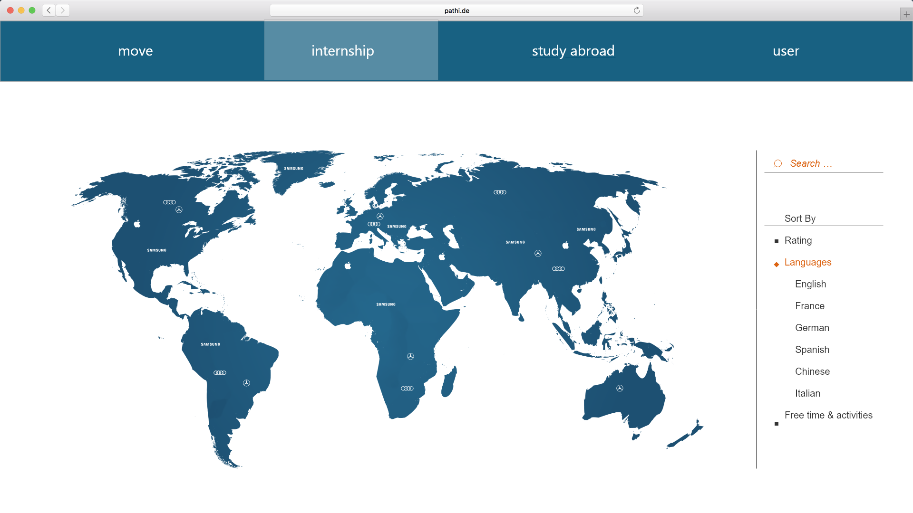

#Ausblick 
Hier finden Sie alles, was wir innerhalb des Projekts nicht geschafft haben und einen Ausblick in die Zukunft.

##Was noch fehlt: 

###Filter
Die Filterlisten in Move sind zwar größtenteils alle vorhanden, allerdings ist keine davon funktional implementiert. Vorgesehen waren Filter auf folgenden Unterseiten:

<h4>Study Abroad</h4>

Auf der linken Seite sind die Punkte Apphabetical, Movers und Rating zwar schon implementiert, alledrings haben die Universitäten in der Datenbank noch keine entsprechenden Daten. Aus diesem Grund konnten wir auch das Rating und die Movers in der Liste noch nicht anzeigen.

Da wir das Zoom System aus unserem Konzept mit Mapbox nicht verwirklichen konnten, haben wir in unserer Html Version keinen Platz für eine Filterliste auf der rechten Seiten. Unsere Lösung dafür wäre ein Filter Icon rechts oben gewesen, das auf einen Klick die Filterkategorien aus und wieder einfahren kann.

<h4> University - Experiences </h4>

Auch hier ist die Filter Liste im Html implementiert, es fehlen jedoch die entsprechenden Daten um eine Funktionalität zu implementieren.

<h4> University - Courses</h4>

Auch hier wurde die Funktionalität noch nicht implementiert.

###Letzte Schritte

Unsere Progress Leiste besteht aus den vier Punkten Finish Profile, Rank your universities, Scholarships und Tell your experience. Davon sind die ersten beiden komplett implementiert. Schließt man im aktuellen Stand seine Bewerbung ab, so erhält man eine kurze Rückmeldung dass die Bewerbung beim International Office eingegangen sei.
Um die Website live schalten zu können, muss das Senden der Bewerbung an das IO natürlich noch implementiert werden. Außerden würde noch eine Informationsseite zu Scholarships und eine Seite, auf der Studenten die aus dem Ausland zurückkommen Erfahrungsberichte verfassen können hinzugefügt werden.

###Internship

Die Internship Seite beinhaltet momentan nur eine Standard Mapbox Karte. Hier muss noch die komplette Datenbankanbindung inplementiert werden.

##Unsere Beschränkungen

Abgesehen von den noch nicht implementierten Features waren wir hauptsächlich in der Verwendung der Karte sehr eingeschränkt. Mit Mapbox war unser im Konzept geplantes Zoomsystem, bei dem der Nutzer von der Weltkarte aus zunächst nur eine Region wie Europa, USA etc. und erst im nächsten Schritt eine konkrete Universität auswählen konnte, nicht umsetzbar. Stattdessen kann der Benutzer nun frei zoomen und die Karte verschieben. Für die Beschränkung auf eine konkrete Region haben wir also nun nur noch die FIlteroptionen zur Verfügung.